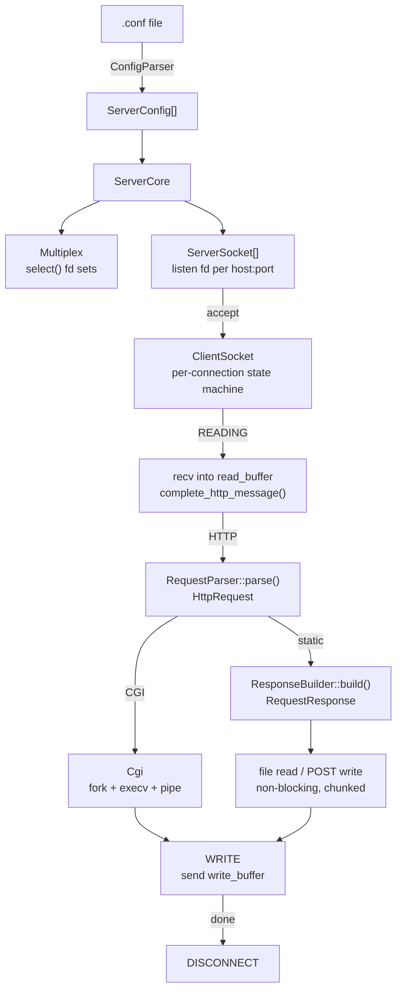

# WebServer

> An HTTP/1.1 web server implemented from scratch in C++98 — built on non-blocking sockets, `select()`-based I/O multiplexing, and a state-machine per-connection model.


---

## Table of Contents

- [Overview](#overview)
- [Key Features](#key-features)
- [Tech Stack](#tech-stack)
- [System Architecture](#system-architecture)
- [The Core Challenge: One Read, One Write Per Client Per Loop](#the-core-challenge-one-read-one-write-per-client-per-loop)
- [Request Lifecycle](#request-lifecycle)
- [Core Concepts](#core-concepts)
- [Key Design Decisions](#key-design-decisions)
- [Performance](#performance)
- [Configuration](#configuration)
- [Project Structure](#project-structure)
- [Getting Started](#getting-started)
- [Future Improvements](#future-improvements)
- [Engineering Notes](#engineering-notes)
- [License](#license)

---

## Overview

WebServer is a C++98-compliant HTTP server that handles concurrent client connections without threads. A single `select()` loop drives all I/O across all connected clients and server sockets simultaneously. Each client connection progresses through an explicit state machine (`READING → HTTP → CGI → FILES → WRITE → DISCONNECT`), ensuring that no single connection can block the event loop.

The project covers the full server stack: TCP socket management, HTTP request parsing, location-based routing, static file serving, multipart POST handling, CGI subprocess execution with timeout enforcement, and a nginx-style configuration file parser.

---

## Key Features

- Concurrent connections via `select()` with no threads or forking per client
- Per-client connection state machine with six explicit states
- **Strictly one read and one write per client per event loop iteration** — the central architectural constraint that keeps the server non-blocking
- HTTP methods: `GET`, `POST`, `DELETE`
- Static file serving with MIME type inference (34 types)
- Directory listing (`autoindex`) with generated HTML
- Multipart `multipart/form-data` upload parsing and non-blocking file write
- CGI execution via `fork`/`execv` with `SIGPIPE` suppression and configurable timeout (default 10 s, kills via `SIGINT` on expiry)
- Virtual server matching by `Host` header against `server_name` directives
- Per-location method allowlist, root override, index file, and autoindex toggle
- Custom error pages per status code, configurable per server block
- `client_max_body_size` enforcement before parsing (`413` response)
- Non-blocking server sockets via `fcntl(O_NONBLOCK)`

---

## Tech Stack

| Category | Technology |
|---|---|
| Language | C++98 |
| Build | GNU Make |
| I/O model | `select()` (POSIX) |
| Networking | POSIX sockets (`socket`, `bind`, `listen`, `accept`, `recv`, `send`) |
| CGI | `fork`, `execv`, `pipe`, `waitpid` (POSIX) |
| File I/O | `open`, `read`, `write`, `close` (POSIX) |
| Config parsing | Custom line-by-line parser (`std::ifstream`) |

`select()` was chosen because it is the POSIX standard multiplexer available under C++98 constraints. It allows the entire server to run in a single thread with deterministic, inspectable fd sets.

---

## System Architecture



**Components:**

| Component | Responsibility |
|---|---|
| `ServerCore` | Startup: deduplicates configs by host:port, creates server sockets, runs the main event loop |
| `Multiplex` | Wraps `select()`: maintains the active fd list, resets read/write sets each iteration, exposes `ready_to_read(fd)` / `ready_to_write(fd)` |
| `ServerSocket` | One per unique `host:port`; accepts new clients via `accept()` when its fd is readable; owns the client list and prunes disconnected clients |
| `ClientSocket` | State machine for one connection; drives `read_request → init_http_process → cgi.process → manage_files → write_response` per loop iteration |
| `RequestParser` | Stateless: parses a complete HTTP request string into an `HttpRequest` value object (method, path, headers, body, host) |
| `ResponseBuilder` | Stateless factory: takes `HttpRequest` + matched `ServerConfig`, routes to the correct builder method, returns a `RequestResponse` |
| `Cgi` | Manages CGI lifecycle with its own sub-state machine: `START → EXECUTECGI → WAITCGI → CORRECT/INCORRECT_CGI`; reads stdout via the write-end pipe |
| `ConfigParser` | Line-by-line nginx-style parser: populates `ServerConfig` and `LocationConfig` structs from a `.conf` file |
| `PostRequestBodySnatcher` | Parses `multipart/form-data` bodies into `PostRequestBodyPart` objects (name, filename, content-type, content) |

---

## The Core Challenge: One Read, One Write Per Client Per Loop

This is the most important architectural constraint in the server and the hardest to get right. **Every I/O stage in `ClientSocket` is limited to exactly one read operation and one write operation per event loop iteration.** This is enforced by `read_operations` and `write_operations` counters that are reset to zero at the start of each `process_connection()` call.

### Why it matters

`select()` reports that a file descriptor is ready — but "ready" means *some* data is available, not *all* data. If you naively loop `recv()` until the buffer is empty inside a single `select()` cycle, one connection with a large slow transfer will monopolize the event loop, starving all other clients. In a single-threaded server, that is effectively a denial of service.

The 100-byte `MAX_BUFFER_SIZE` makes this constraint both concrete and absolute: every read, write, file read, and file write is bounded to 100 bytes per call. A client transferring a 1 MB file will do so across ~10,000 loop iterations — but each iteration is equally fair to every other connected client.

### How it's enforced

At the top of `process_connection()`, both counters are zeroed:

```cpp
void ClientSocket::process_connection(ServerSocket &server) {
    read_operations  = 0;
    write_operations = 0;
    read_request();
    init_http_process(server.get_possible_configs());
    cgi.process(*this);
    manage_files();
    write_response();
}
```

Each stage guards its I/O behind the counter:

```cpp
// In manage_files() — file read stage
if (read_operations > 0)   // already read once this iteration
    return;                // yield back to the event loop
// ... do one 100-byte read, then:
read_operations++;

// In write_response() — send stage
if (write_operations > 0)  // already wrote once this iteration
    return;
// ... do one 100-byte send, then:
write_operations++;
```

This unconditional call chain (`read_request → init_http_process → cgi.process → manage_files → write_response`) is safe to invoke every iteration for every client precisely because each function is a no-op unless its preconditions are met — the right state enum *and* no prior I/O this cycle.

### The same discipline applies to CGI

CGI adds a pipe between the server and a child process, and that pipe must obey the same rules. Both pipe ends are registered with `Multiplex`. The `correct_cgi()` method checks `client.read_operations > 0` before reading from the pipe, and increments the counter after each 100-byte chunk. A misbehaving or slow Python script cannot block the loop because the server simply skips reading the pipe on any iteration where another read has already occurred.

### The tradeoff

This design is correct and safe, but it is deliberately throughput-limited. A single large file costs many loop iterations to transmit. See the [Performance](#performance) section for measured numbers.

---

## Request Lifecycle

A complete HTTP request through the server:

1. **`select()` fires** — `Multiplex::reset_select()` rebuilds both fd sets from the active fd list and calls `select()`. Readable/writable state is then queryable per fd for this loop iteration.

2. **Accept** — `ServerSocket::accept_new_client_connection()` calls `accept()` only if its listening fd is readable. The new client fd is added to `Multiplex` and a `ClientSocket` is appended to the server's client list.

3. **`READING`** — `ClientSocket::read_request()` calls `recv()` and appends bytes to `read_buffer`. `Utils::complete_http_message()` checks that the full request has arrived by inspecting `\r\n\r\n` and comparing `Content-Length` against the buffered body size. Partial reads leave state unchanged; the next loop iteration continues accumulating.

4. **`HTTP`** — `init_http_process()` calls `RequestParser::parse()` on the complete buffer, matches the `Host` header against configured `server_name` values to select a `ServerConfig`, then calls `ResponseBuilder::build()`. If the request targets `/cgi-bin` with a matching extension, a CGI response object is returned with only a `cgi_path` set; otherwise a `RequestResponse` with a file path or inline body is returned.

5. **`CGI`** (if applicable) — `Cgi::process()` advances its own sub-state machine:
   - `START`: opens a `pipe()`, registers both ends with `Multiplex`
   - `EXECUTECGI`: `fork()`s when the write-end is writable; child `dup2`s the write-end to stdout and calls `execv` with the interpreter and script path; parent removes the write-end from `Multiplex` and records start time
   - `WAITCGI`: calls `waitpid(WNOHANG)` each iteration; kills the child with `SIGINT` if `MAX_TIME_CGI` seconds elapse (504 response)
   - `CORRECT_CGI`: reads the script's stdout from the pipe read-end in `MAX_BUFFER_SIZE` chunks into `write_buffer`; advances to `WRITE` when the pipe is exhausted

6. **`FILES`** — for static responses, reads the file in `MAX_BUFFER_SIZE`-byte chunks into the response body; for POST uploads, writes each `multipart/form-data` part to its target file descriptor one chunk per loop iteration, respecting the read/write operation counters to avoid blocking.

7. **`WRITE`** — `write_response()` sends `write_buffer` in `MAX_BUFFER_SIZE`-byte chunks via `send()`, tracking `write_offset`. Advances to `DISCONNECT` when all bytes are sent.

8. **`DISCONNECT`** — `ServerSocket::delete_disconnected_clients()` removes the fd from `Multiplex`, closes it, and erases the `ClientSocket` from the vector.

---

## Core Concepts

### `select()` Event Loop and the Operation Counters

`select()` is called once per iteration with a fresh copy of all active fds in both read and write sets. `Multiplex::ready_to_read(fd)` / `ready_to_write(fd)` wrap `FD_ISSET` against the sets populated by that call.

`ClientSocket` tracks `read_operations` and `write_operations` (reset to 0 each iteration). Stages that perform I/O check these counters to ensure at most one read and one write per fd per `select()` cycle, preventing a single slow client from consuming the loop.

### Request Completeness Detection

`Utils::complete_http_message()` determines whether the entire HTTP message has been buffered before parsing begins:
- Requires `\r\n\r\n` to be present (end of headers)
- If `Content-Length` is present, compares declared size against the number of bytes after the header boundary
- Handles `Transfer-Encoding: chunked` by checking for the terminal `0\r\n\r\n` marker

This avoids passing a partial request to the parser and correctly handles requests whose body arrives across multiple `recv()` calls.

### Location Matching

`ResponseUtils::findLocation()` implements longest-prefix matching: it iterates all configured `LocationConfig` entries and returns the one whose `path` is the longest prefix of the request URI. This mirrors nginx's `location` block behaviour.

### Virtual Host Selection

Multiple `server {}` blocks may share the same `host:port`. At accept time they are grouped into a `HostPortConfigMap` (keyed by `"host:port"` string) so a single `ServerSocket` serves all virtual hosts on that address. Per request, `Utils::find_match_config()` scans the candidate `ServerConfig` list for a `server_name` matching the request `Host` header, falling back to the first config if none matches.

### CGI Timeout Enforcement

`Cgi::wait_cgi()` uses `WNOHANG` so the event loop is never blocked waiting for a child. It records `start_time` via `clock()` at fork time and computes elapsed time each iteration. If the child exceeds `MAX_TIME_CGI` seconds it is sent `SIGINT` and a `504 Gateway Timeout` response is issued. `SIGPIPE` is globally suppressed at startup (`signal(SIGPIPE, SIG_IGN)`) to prevent the server from dying if a client closes the connection before the response is fully sent.

### Multipart Upload — Non-Blocking Write Pipeline

POST file uploads go through two stages:
1. `PostRequestBodySnatcher::parse()` splits the `multipart/form-data` body on the boundary string into `PostRequestBodyPart` objects, extracting `Content-Disposition` metadata and raw content.
2. `ClientSocket::manage_files()` opens each output file with `O_CREAT | O_APPEND` and writes content in `MAX_BUFFER_SIZE` chunks across loop iterations, using `write_offset` and the `write_operations` counter. The client does not advance to `WRITE` until all file parts have been fully flushed.

---

## Key Design Decisions

| Decision | Rationale |
|---|---|
| Single `select()` loop, no threads | C++98 constraint; avoids synchronisation complexity; all concurrency managed via the state machine |
| State machine per `ClientSocket` | Makes partial I/O safe and resumable across loop iterations without blocking; each stage is a no-op if preconditions are not met |
| **One read + one write per client per iteration** | **Core fairness guarantee: prevents any single connection from monopolising the event loop regardless of transfer size or speed** |
| `MAX_BUFFER_SIZE 100` bytes for send/recv | Keeps each stage strictly bounded; a single connection cannot saturate the loop even for large transfers |
| Stateless `RequestParser` and `ResponseBuilder` | Pure functions with no shared state; makes the pipeline straightforward to reason about and extend |
| Grouped configs by `host:port` at startup | Avoids redundant sockets; a single fd handles all virtual hosts on the same address, reducing fd usage |
| CGI via `fork`/`execv` into a pipe | Conforms to the CGI standard; allows any interpreter to be used without embedding a scripting engine |
| `WNOHANG` in CGI wait | Keeps the event loop non-blocking even during slow or hung CGI scripts |

---

## Performance

These benchmarks were measured on a Linux x86_64 host with the server running from source under the default configuration (`conf/default.conf`). No keep-alive is supported, so every request involves a full TCP connect/disconnect cycle — this is the dominant latency cost at low connection counts.

### Tool

[`wrk`](https://github.com/wg/wrk) — HTTP benchmarking tool.

---

### Throughput vs. concurrency

| Endpoint | Connections | Duration | Req/s | Avg latency | p50 | p99 |
|---|---|---|---|---|---|---|
| `GET /uploads/` (autoindex, 348 B) | 3 | 5 s | **496** | 12.3 ms | 1.7 ms | 64.7 ms |
| `GET /uploads/` (autoindex, 348 B) | 10 | 5 s | **509** | 23.8 ms | — | — |
| `GET /uploads/` (autoindex, 348 B) | 20 | 10 s | **517** | 37.0 ms | — | — |
| `GET /` (index.html, 11,997 B) | 5 | 5 s | **62** | 75.5 ms | 90.6 ms | 108 ms |
| `GET /` (index.html, 11,997 B) | 10 | 10 s | **60** | 160 ms | — | — |

> **Reading the numbers:** throughput on the lightweight autoindex endpoint plateaus around 500 req/s regardless of connection count — the server is CPU-bound on the `select()` loop, not I/O-bound. The heavier `index.html` endpoint is 8× slower because each response requires ~120 send iterations through the 100-byte buffer (11,997 ÷ 100).

---

### Buffer iteration cost

The 100-byte `MAX_BUFFER_SIZE` means every response payload is transmitted in small chunks spread across many loop iterations. This is what makes the server fair to all clients under load — but it caps per-connection throughput:

| File | Size | Send iterations (@ 100 B) | Notes |
|---|---|---|---|
| autoindex HTML | 348 B | **4** | Nearly instant |
| `index.html` | 11,997 B | **120** | Main page |
| `404.gif` | 21,684 B | **217** | Error image |
| `netcat.jpg` | 36,598 B | **366** | Static asset |
| `logo.gif` | 52,493 B | **525** | Animated logo |
| `background.avif` | 87,850 B | **879** | Background image |

A client downloading `background.avif` occupies a connection slot for ~879 event loop iterations. With a 1 s `select()` timeout and ~500 iterations/s throughput capacity, this is roughly 1.8 seconds of wall time for that single file — during which all other connected clients continue being served normally.

---

### Request latency (sequential, `GET /uploads/`)

100 sequential requests, measured end-to-end including TCP setup:

| Percentile | Latency |
|---|---|
| p50 | ~1.7 ms |
| p90 | ~47 ms |
| p99 | ~65 ms |

---

### Running benchmarks yourself

```sh
# Install wrk
apt-get install wrk

# Lightweight endpoint (autoindex)
wrk -t2 -c10 -d10s --latency http://127.0.0.1:8080/uploads/

# Heavy endpoint (full HTML page)
wrk -t2 -c10 -d10s --latency http://127.0.0.1:8080/

# Single-connection latency
curl -w "connect: %{time_connect}s  ttfb: %{time_starttransfer}s  total: %{time_total}s\n" \
     -o /dev/null -s http://127.0.0.1:8080/
```

---

## Configuration

The server reads an nginx-style `.conf` file. Multiple `server {}` blocks are supported.

```nginx
server {
    listen 127.0.0.1:8080        # host:port (port only = 127.0.0.1 default)
    server_name mysite.local     # matched against Host header
    root www                     # document root
    index index.html             # default index file
    client_max_body_size 1M      # request body limit (enforced pre-parse)
    error_page 404 /error/404.html

    location / {
        allow_methods GET
        autoindex off
        root www
    }

    location /uploads {
        allow_methods GET POST DELETE
        autoindex on
        root www
    }

    location /cgi-bin {
        root www
        cgi_path /usr/bin/python3    # interpreter path
        cgi_ext .py                  # matched by extension
    }
}
```

**Supported directives:**

| Directive | Scope | Description |
|---|---|---|
| `listen` | server | `host:port` or `host` (defaults port to 8080) |
| `server_name` | server | Space-separated virtual host names |
| `root` | server, location | Document root directory |
| `index` | server, location | Default file for directory requests |
| `error_page` | server | Custom error page per status code |
| `client_max_body_size` | server | Max allowed request body size in bytes |
| `allow_methods` | location | Whitelist of permitted HTTP methods |
| `autoindex` | location | Enable directory listing (`on`/`off`) |
| `cgi_path` | location (`/cgi-bin`) | Path to the CGI interpreter binary |
| `cgi_ext` | location (`/cgi-bin`) | File extension triggering CGI execution |

---

## Project Structure

```
src/
  server/
    ServerCore        # event loop, startup, server socket setup
    ServerSocket      # listen socket, accept, client list management
    ClientSocket      # per-connection state machine, I/O coordination
    Multiplex         # select() wrapper, fd set management
    Cgi               # CGI subprocess lifecycle with sub-state machine
    Utils             # host/port parsing, config matching, I/O helpers
  request_parser/
    RequestParser     # stateless HTTP message parser → HttpRequest
    HttpRequest       # request value object (method, path, headers, body)
  response_builder/
    ResponseBuilder   # stateless response factory, method dispatch, routing
    ResponseUtils     # location matching, MIME types, method allow check
    RequestResponse   # response value object (status, headers, body/file path)
  config/
    ConfigParser      # nginx-style .conf parser → ServerConfig[]
    ServerConfig      # per-server configuration (locations, CGI, error pages)
  post_request_body_handling/
    PostRequestBodySnatcher   # multipart/form-data boundary parser
    PostRequestBodyPart       # individual form part (name, filename, content)
conf/
  default.conf        # default server configuration
www/                  # static site root (HTML, images, uploads, CGI scripts)
```

---

## Getting Started

### Requirements

- Linux
- GCC (C++98 mode)
- GNU Make

### Build & Run

```sh
make
./webserv conf/default.conf
```

```sh
make clean    # remove object files
make fclean   # remove object files and binary
make re       # fclean + rebuild
```

### Test

```sh
curl -i http://127.0.0.1:8080/
curl -i http://127.0.0.1:8080/uploads/
curl -i -X DELETE http://127.0.0.1:8080/uploads/file.txt
curl -i -X POST -F "file=@photo.jpg" http://127.0.0.1:8080/uploads/
curl -i http://127.0.0.1:8080/cgi-bin/hello.py
```

---

## Future Improvements

- **`poll()` or `epoll()`** — replace `select()` to remove the `FD_SETSIZE` (1024) fd limit and improve scalability under high connection counts
- **Larger adaptive buffer** — make `MAX_BUFFER_SIZE` configurable or dynamic; even bumping to 4,096 bytes would reduce send iterations for `background.avif` from 879 to 22, dramatically improving throughput for large assets without compromising fairness
- **Chunked transfer encoding** — full `Transfer-Encoding: chunked` send support for large or streaming responses
- **Keep-alive connections** — reset client state to `READING` after `WRITE` rather than always disconnecting; requires `Connection` header inspection and an idle timeout; would eliminate the TCP setup/teardown cost that currently dominates latency at low concurrency
- **HTTP redirects** — implement the `return` and `alias` location directives already parsed by `ConfigParser` but not yet routed in `ResponseBuilder`
- **Range requests** — `Range` header support for partial content delivery (video streaming, resumable downloads)
- **Stress testing** — integration with `siege` or `wrk` to measure throughput and identify per-client fairness issues under the 100-byte buffer constraint

---

## Engineering Notes

**The one-read-one-write rule is the hardest thing to get right.**
Every I/O stage in the server must complete in at most one syscall per `select()` cycle. This sounds simple but is surprisingly easy to violate: a helper function that loops internally, a file read that drains the fd, or a CGI pipe read that pulls all available bytes — any of these will silently block all other clients. The `read_operations` and `write_operations` counters per `ClientSocket` make this contract visible and enforceable. The discipline must extend to every component that touches an fd, including the CGI pipe management in `Cgi::correct_cgi()`.

**The 100-byte buffer is the sharpest constraint in the system.**
`MAX_BUFFER_SIZE 100` means every send, recv, file read, and file write is bounded to 100 bytes per call per loop iteration. This guarantees the event loop is never monopolised by a large transfer, but it also means a 1 MB file upload requires ~10,000 loop iterations per client. The design is correct and safe; the tradeoff is throughput under load (measured: ~62 req/s for an 11 KB page vs. ~500 req/s for a 348-byte response).

**The state machine makes partial I/O safe without callbacks.**
Each stage in `ClientSocket::process_connection()` begins with a guard that checks the current state and the relevant `Multiplex` readiness flag. If either is false the function is a no-op. This means the call sequence `read_request → init_http_process → cgi.process → manage_files → write_response` can safely be called unconditionally every iteration — only the stage matching the current state actually executes. This is a clean alternative to callback chains or coroutines within C++98 constraints.

**CGI is the hardest component to keep non-blocking.**
The pipe between the server and the child process must be managed with the same `select()` discipline as client sockets. Both pipe ends are registered with `Multiplex`; the write-end is removed immediately after `fork()` (the child owns it); the read-end is polled for readability before each chunk read. `WNOHANG` on `waitpid` ensures the server never sleeps waiting for a script. The timeout kill path is the one place where system state (a live child process) must be cleaned up regardless of connection state.

**Virtual host dispatch happens at two levels.**
At startup, `ServerCore::unique_host_port_configs()` groups all `ServerConfig` objects by `host:port` string into a `HostPortConfigMap`. This determines how many `ServerSocket` instances are created — one per unique address. At request time, `Utils::find_match_config()` does a second-level dispatch within that group using the `Host` header. The fallback to `possible_configs[0]` mirrors nginx's behaviour of using the first matching server block as the default.

---

## License

This project is licensed under the MIT License.

---

[↑ Back to top](#webserver)
